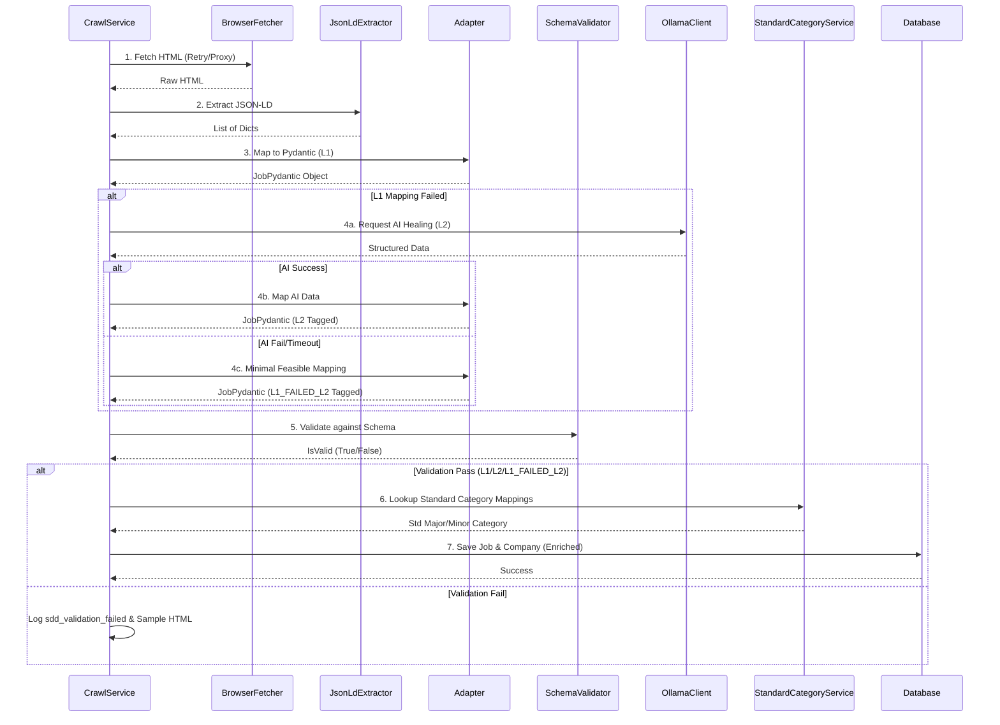
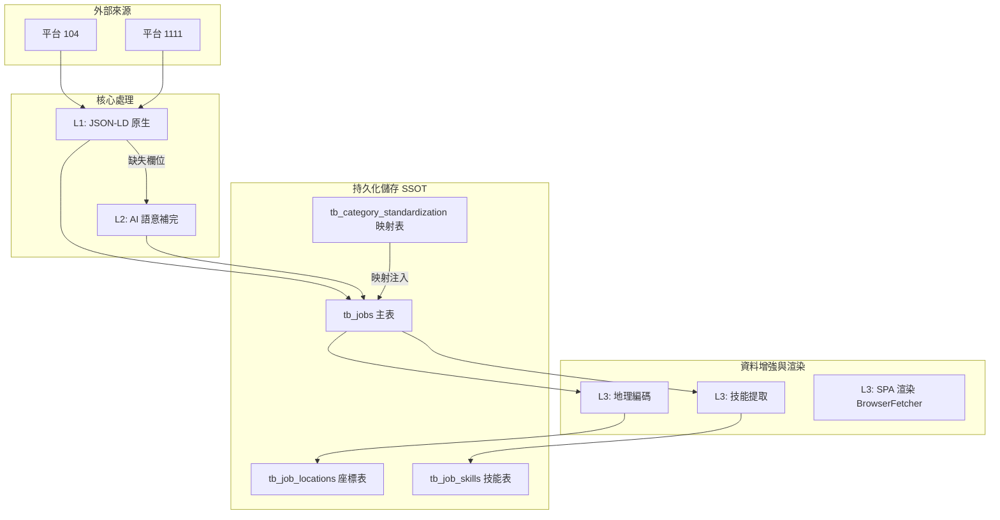
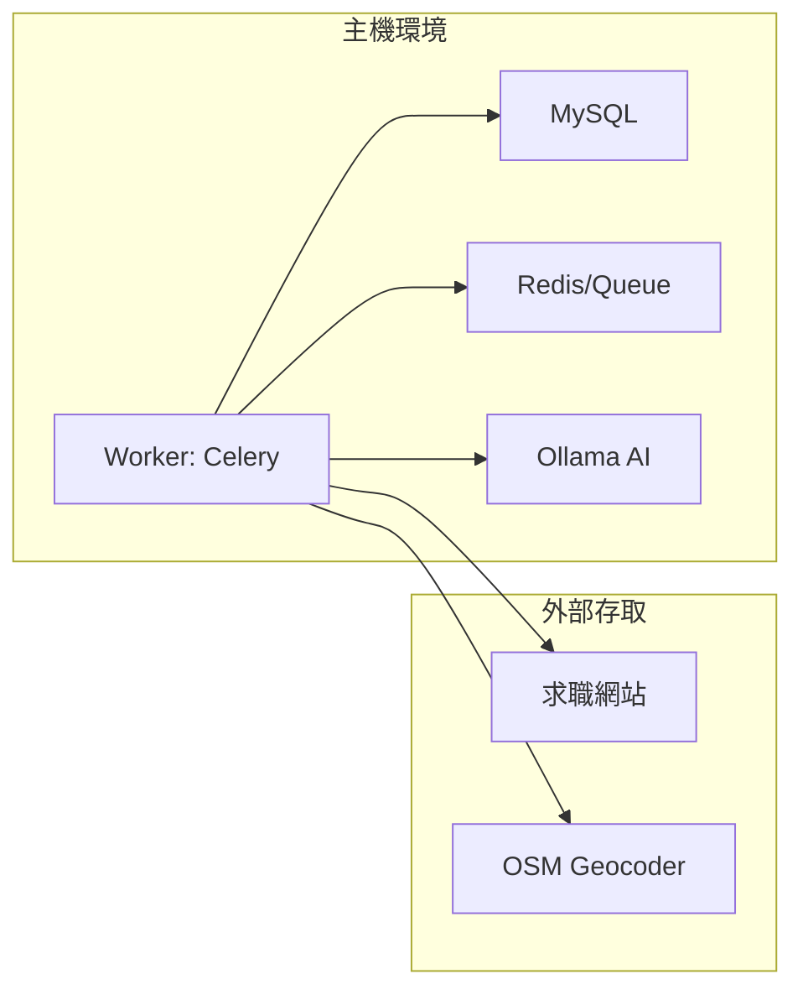
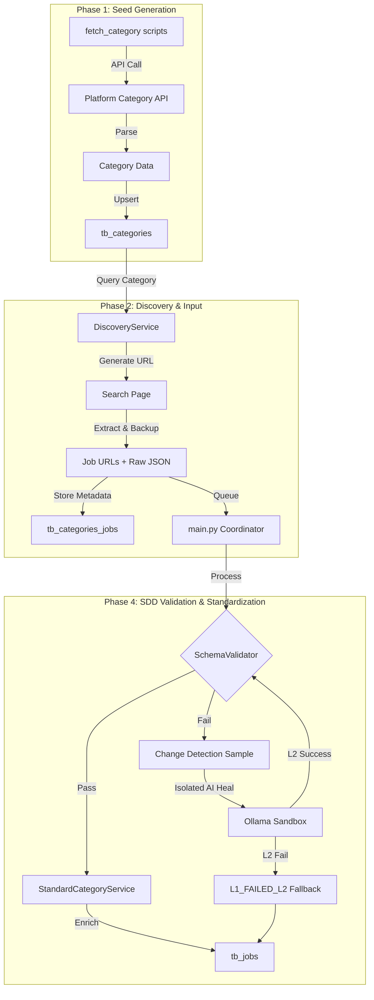

# SDD 架構詳解 (System Architecture)

> [!NOTE]
> 本文件深度解析系統內部組件的互動邏輯、資料流動與安全隔離機制。

---

## 1. 核心處理序列 (Core Sequence Diagram)

以下展示 `CrawlService` 處理一個職缺 URL 的完整生命週期：

---

## 2. 資料流與 SSOT 隔離 (Data Flow)

系統嚴格遵循 **L1 -> L2 -> L3** 的資料增長路徑：

---

## 3. AI 隔離保護機制 (AI Sandboxing)

為了防止 Ollama 當機或輸出無意義（幻覺）內容影響系統穩定性，我們實作了**故障隔離器 (Circuit Breaker)**：

| 元件 | 職責 | 觸發條件 |
| :--- | :--- | :--- |
| **相似度檢查** | 防止 AI 產生與頁面無關的標題 | Levenshtein 相似度 < 0.3 |
| **失敗隔離** | 當 AI 連續失敗時暫停調用 | `AI_FAILURE_LIMIT >= 5` |
| **隔離倒數** | 暫停後自動恢復的時間窗口 | 3600 秒 (1 小時) |
| **資源限制** | 確保 AI 不會耗盡主機 CPU | Ollama 運行於獨立 Docker Container |

---

## 4. 部署拓撲 (Deployment Topology)

---

## 5. 資料一致性與同步 (Linkage Sync)

- **自動關聯**：當職缺資料包含 `company_source_id` 時，系統會自動在存儲時建立與 `tb_companies` 的連結。
- **孤兒職缺**：若職缺無法關聯到已有公司且無法提取公司資訊，則會被記錄至 `tb_data_issues`。
- **更新策略**：主表使用 `ON DUPLICATE KEY UPDATE`，確保座標與技能等增強資訊不會覆蓋 L1/L2 核心資料。

---

## 6. 詳細資料流程 (Detailed Data Flow)

### 6.1 全域處理流程 (Global Flow)

### 6.2 資料實體演變 (Data Entity Lifecycle)

- **Category (分類)**：獲取平台內部的分類代碼，作為發現階段的起始種子。
- **Job (職缺)**：由 `JsonLdExtractor`鎖定 `@type: JobPosting` 節點。通過 `_clean_taiwan` 與 `_dedupe_address` 確保符合台灣標準格式。
- **Company (公司)**：從 `JobPosting` 的 `hiringOrganization` 屬性中分離，作為 SSOT。
- **Discovery Link (發現關聯)**：記錄職缺與分類的發現關係，並存儲 `raw_json` 摘要作為追蹤基礎。

### 6.3 關鍵技術實現

- **台灣地址歸一化**：移除贅字（台灣、台灣省）、提取行政區（region/district）、組合去重。
- **Facebook User-Agent**：針對 104 等 SSR 平台，使用 `facebookexternalhit` 取得完整渲染內容，確保 JSON-LD 完整性。
